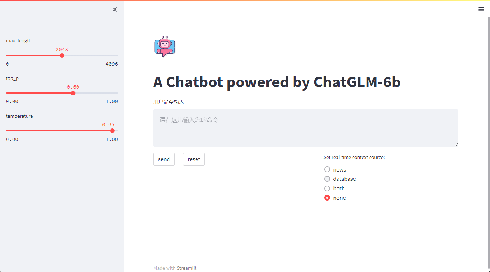
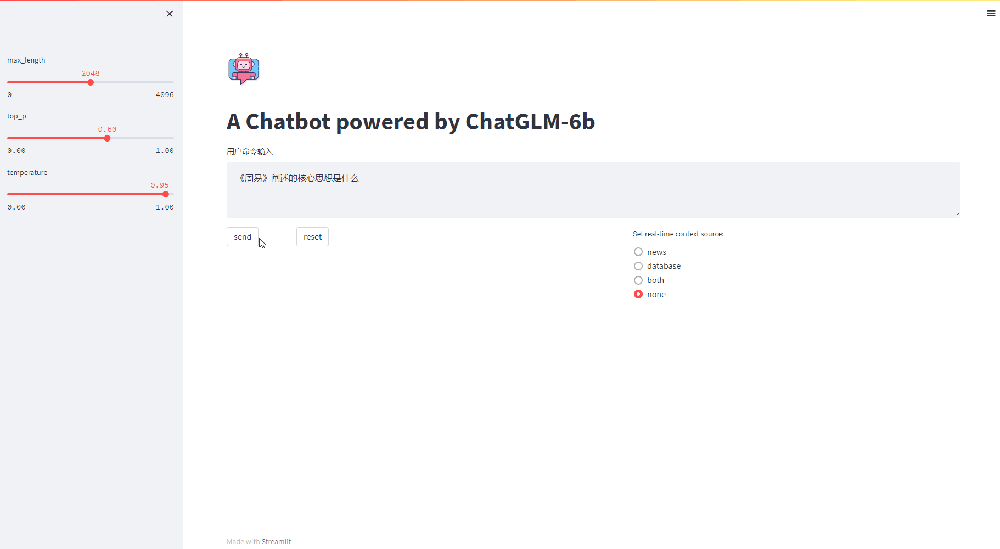
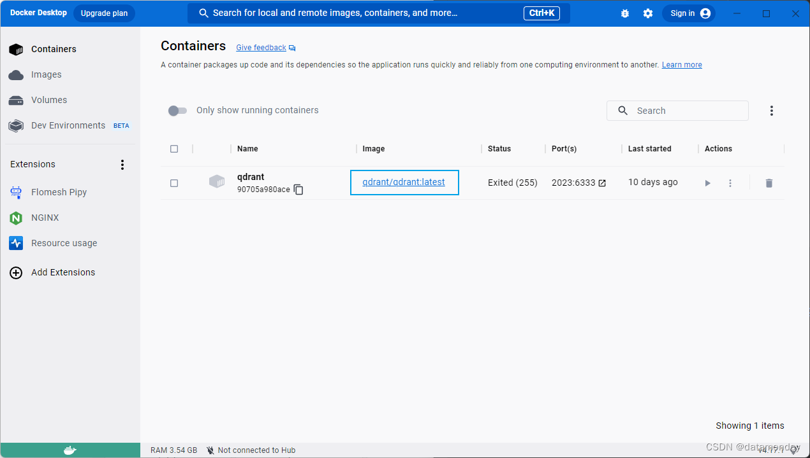
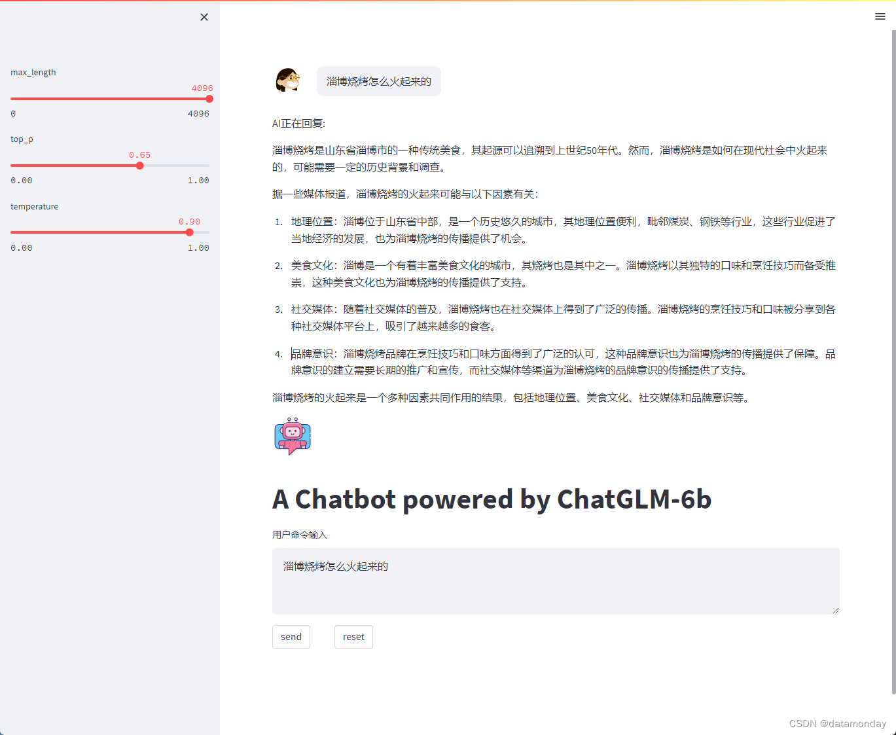
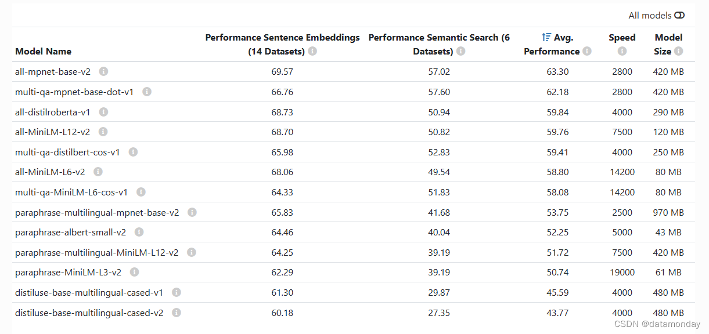
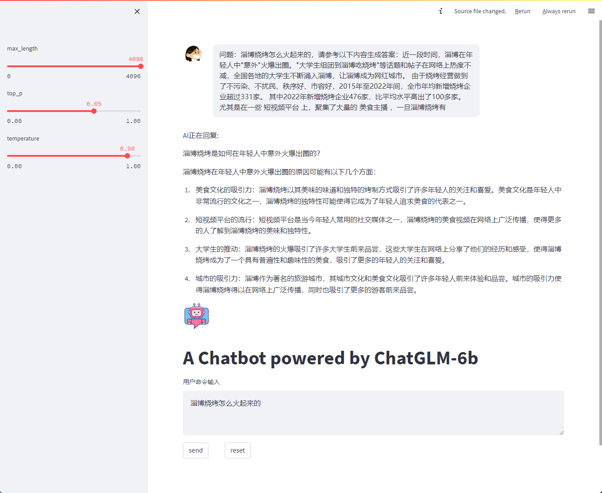

# O.Bubble

A private chatbot deployed on local.







本地部署chatglm及缓解时效性问题的思路：

模型使用chatglm-6b 4bit，推理使用hugging face，前端应用使用streamlit或者gradio。

微调对显存要求较高，还没试验。可以结合LoRA进行微调。

缓解时效性问题：通过本地数据库或者搜索引擎获取特有数据或者实时数据作为生成模型的上下文。

- 向量数据库实现思路：先将特有数据转换为embedding存入向量数据库，在调用模型生成问答时，先将query转换成embedding，然后从数据库查询相近的结果作为上下文。embedding生成可以使用sentence_transformer库，向量数据库可以使用qdrant或者milvus。
- 搜索引擎实现思路：在调用大模型生成问答时，先用搜索引擎搜索相关的词条，将词条内容或者摘要作为上下文输入到模型。搜索引擎可以使用duckduckgo_search库。

# 1.运行环境配置

windows 11

32G 内存

GTX 3080Ti

## 1.1 PyTorch

安装anaconda或者miniconda

创建虚拟环境：

```shell
conda create -n chatbot python=3.9
```

激活虚拟环境：

```shell
conda activate chatbot
```

主要依赖的包：

1）pytorch-gpu

> Currently, PyTorch on Windows only supports Python 3.7-3.9; Python 2.x is not supported.

```shell
conda install pytorch torchvision torchaudio pytorch-cuda=11.7 -c pytorch -c nvidia
```

2）hugging face

```shell
conda install -c huggingface transformers
```

3）streamlit

```shell
pip install streamlit
pip install streamlit-chat
```

4）sentencepiece 和 cpm-kernels

```shell
pip install sentencepiece
pip install cpm-kernels
```

5）sentence-transformers

```shell
conda install -c conda-forge sentence-transformers
```

6）qdrant-client

```shell
pip install qdrant-client
```

7）duckduckgo_search

```shell
pip install -U duckduckgo_search
```

> 
>
> 参考：
>
> [Start Locally | PyTorch](https://pytorch.org/get-started/locally/)
>
> [Installation (huggingface.co)](https://huggingface.co/docs/transformers/installation)
>
> [Installation - Streamlit Docs](https://docs.streamlit.io/library/get-started/installation)
>
> [Installation — Sentence-Transformers documentation (sbert.net)](https://www.sbert.net/docs/installation.html)
>
> [Install - Qdrant](https://qdrant.tech/documentation/install/)

## 1.2 requirements

安装：

```shell
# 建议用这个
conda env create -f freeze.yml

pip install -i https://pypi.tuna.tsinghua.edu.cn/simple -r requirements.txt
```

导出虚拟环境的依赖包命令：

```shell
conda env export > freeze.yml

pip list --format=freeze > ./requirements.txt
```

## 1.3 Docker

用于运行QDrant数据库：




> 可以参考：[Install Docker Desktop on Windows | Docker Documentation](https://docs.docker.com/desktop/install/windows-install/)

## 1.4 QDrant

> 可以参考：https://github.com/qdrant/qdrant

## 1.5 报错及处理

### streamlit报错1

报错信息：

```shell
AttributeError: module 'click' has no attribute 'get_os_args'
```

解决措施：

```she
pip install -U click==8
```

> 参考：https://github.com/streamlit/streamlit/issues/4555

### streamlit报错2

报错信息：

```shell
AttributeError: module 'streamlit' has no attribute 'cache_resource'
```

解决措施：

```python
# 去掉这个装饰器或者替换为
@st.cache
```

> 参考：https://discuss.streamlit.io/t/attributeerror-module-streamlit-has-no-attribute-cache/25155

# 2.大模型构建

## 2.1 开源模型

### ChatGLM

从github下载chatglm-6b工程：[THUDM/ChatGLM-6B](https://github.com/THUDM/ChatGLM-6B)

从抱抱脸下载chatglm-6b-int4模型：[THUDM/chatglm-6b-int4](https://huggingface.co/THUDM/chatglm-6b-int4)

> 官方介绍：
>
> ChatGLM-6B 是一个开源的、支持中英双语问答的对话语言模型，基于 [General Language Model (GLM)](https://github.com/THUDM/GLM) 架构，具有 62 亿参数。结合模型量化技术，用户可以在消费级的显卡上进行本地部署（INT4 量化级别下最低只需 6GB 显存）。ChatGLM-6B 使用了和 [ChatGLM](https://chatglm.cn/) 相同的技术，针对中文问答和对话进行了优化。经过约 1T 标识符的中英双语训练，辅以监督微调、反馈自助、人类反馈强化学习等技术的加持，62 亿参数的 ChatGLM-6B 已经能生成相当符合人类偏好的回答。
>
> ChatGLM-6B-INT4 是 ChatGLM-6B 量化后的模型权重。具体的，ChatGLM-6B-INT4 对 ChatGLM-6B 中的 28 个 GLM Block 进行了 INT4 量化，没有对 Embedding 和 LM Head 进行量化。量化后的模型理论上 6G 显存（使用 CPU 即内存）即可推理，具有在嵌入式设备（如树莓派）上运行的可能。
>
> 在 CPU 上运行时，会根据硬件自动编译 CPU Kernel ，请确保已安装 GCC 和 OpenMP （Linux一般已安装，对于Windows则需手动安装），以获得最佳并行计算能力。

### 其他大模型

| 模型        | 作者   | 开源协议   | 链接                                                  |
| ----------- | ------ | ---------- | ----------------------------------------------------- |
| BLOOM       | Google | Apache-2.0 | https://huggingface.co/bigscience/bloom               |
| ColossoalAI |        | Apache-2.0 | https://colossalai.org/zh-Hans/                       |
| LLaMa       |        |            | https://github.com/facebookresearch/llama             |
| Alpaca      |        |            | https://crfm.stanford.edu/2023/03/13/alpaca.html      |
| T5          |        |            | https://huggingface.co/docs/transformers/model_doc/t5 |
| Cerebras    |        | Apache-2.0 | https://huggingface.co/cerebras/Cerebras-GPT-6.7B     |
| 文心一言    |        |            |                                                       |
| 通义千问    |        |            |                                                       |
| 盘古        |        |            |                                                       |

## 2.2 微调

对显存要求较高，暂未试验。

### 制作微调数据集

> 可以参考：
>
> [huang1332/finetune_dataset_maker](https://github.com/huang1332/finetune_dataset_maker)

### 基于LoRA/P-Tuning进行微调

> 可以参考：
>
> [极低资源微调大模型方法LoRA以及BLOOM-LORA实现代码](https://zhuanlan.zhihu.com/p/618073170)
>
> [ChatGLM-6B/ptuning](https://github.com/THUDM/ChatGLM-6B/tree/main/ptuning)
>
> [mymusise/ChatGLM-Tuning](https://github.com/mymusise/ChatGLM-Tuning)

## 2.3 推理

### Hugging Face

```python
from transformers import AutoModel, AutoTokenizer
```

### 模型采样算法

ChatGPT有两个重要的参数是temperature和top_p，HuggingFace的AutoModel有两个类似的参数是temperature和top_k。上述这三个方法都是采样方法，用于因果语言模型中在给定上下文的情景下预测下一个单词出现的概率。

在进行预训练时，往往使用“完形填空”的形式，例如给定上文预测下文。基于贪心策略的思路是选择下文单词概率最大的单词，但是这样会让大模型的注意力只集中在最近的几个单词（token）上，导致最终模型生成效果会非常生硬和可预测。

为了让模型具有一定的创新性（随机性），可以使用基于分布采样的生成采样算法。

Top-k采样从排名前 k （即采样列表的大小为k）的token种进行抽样，允许其他分数或概率较高的token也有机会被选中。在很多情况下，这种抽样带来的随机性**有助于提高生成质量**。

Top-k采样的缺点是k的取值不好确定，无法保证最优。所以ChatGPT引入了动态设置k大小的策略——即刻采样（Nucleus Sampling）。top-p 值通常设置为比较高的值（如0.75），目的是限制低概率token的长尾。可以同时使用top-k和top-p，top-p策略在top-k策略之后生效。

温度采样受统计热力学的启发，高温意味着更可能遇到低能态。在概率模型中，logits扮演着能量的角色，我们可以通过将logits除以温度来实现温度采样，然后将其输入Softmax并获得采样概率。

总的来说，温度参数用来调整候选词的概率分布。温度越低，模型对其首选越有信心；温度>1度会降低信心，模型不确定性增加，趋近于正无穷的温度相当于均匀采样（候选词的概率都相同，完全随机）。通常，温度设在[0.7, 0.9]之间是创造性任务最常见的温度。

> 参考：[ChatGPT模型采样算法详解](https://blog.csdn.net/jarodyv/article/details/128994176)

# 3.前端应用

## 3.1 Streamlit

ChatGLM工程中提供了两个demo，基于streamlit的是其中之一，另一个是基于gradio的。

> https://streamlit.io/

## 3.2 LangChain

LangChain是一个用于开发由语言模型驱动的应用程序的框架。它提供了一套工具、组件和接口，可简化创建由大型语言模型 (LLM) 和聊天模型提供支持的应用程序的过程。LangChain 可以轻松管理与语言模型的交互，将多个组件链接在一起，并集成额外的资源，例如 API 和数据库。

> https://docs.langchain.com/docs/
>
> https://zhuanlan.zhihu.com/p/620529542

## 3.3 展示效果




# 4.时效性问题解决方案

核心思路：通过本地数据库或者搜索引擎获取特有数据或者实时数据作为生成模型的上下文。

向量数据库实现思路：先将特有数据转换为embedding存入向量数据库，在调用模型生成问答时，先将query转换成embedding，然后从数据库查询相近的结果作为上下文。

1）embedding生成可以使用sentence_transformer库

2）向量数据库可以使用qdrant或者milvus

搜索引擎实现思路：在调用大模型生成问答时，先用搜索引擎搜索相关的词条，将词条内容或者摘要作为上下文输入到模型。

1）搜索引擎库可以使用duckduckgo_search包

大模型使用chatglm-6b 4bit，推理使用hugging face，前端应用使用streamlit或者gradio。

## 4.1 embedding模型

模型介绍：[Pretrained Models — Sentence-Transformers](https://www.sbert.net/docs/pretrained_models.html)




模型下载：[Models - Hugging Face](https://huggingface.co/models?library=sentence-transformers)

本项目中使用：`multi-qa-MiniLM-L6-cos-v1`。

```shell
git clone https://huggingface.co/sentence-transformers/multi-qa-MiniLM-L6-cos-v1
```

## 4.2 向量数据库构建

```python
def dataset2qdrant(root_path, file_path, embed_length: int = 384):
    client = QdrantClient("localhost", port=2023)
    collection_name = "data_collection"
    client.recreate_collection(
        collection_name=collection_name,
        vectors_config=VectorParams(size=embed_length, distance=Distance.COSINE)
    )

    count = 0
    file_dir = os.path.join(root_path, file_path)
    for root_path, dirs, files in os.walk(file_dir):
        for file in tqdm.tqdm(files):
            file_path = os.path.join(root_path, file)
            with open(file_path, "r", encoding="utf-8") as f:
                text = f.readlines()
                for per_line in text:
                    parts = per_line.split("##")
                    item = text2embedding(parts[1])
                    client.upsert(collection_name=collection_name,
                                  wait=True,
                                  points=[PointStruct(id=count, vector=list([float(x) for x in item.tolist()]),
                                                      payload={"title": parts[0], "response": parts[1]})]
                                  )
                    count += 1
```

> 参考：[基于GPT3.5实现本地知识库解决方案-利用向量数据库和GPT向量接口-实现智能回复并限制ChatGPT回答的范围](https://cloud.tencent.com/developer/article/2245892)

## 4.3 搜索引擎构建

主要使用查询新闻的接口：

```python
from typing import List

from duckduckgo_search import ddg_news


def get_news(keywords: str) -> List[dict]:
    return ddg_news(keywords, safesearch='Off', time='w', max_results=5)
```


## 4.4 增加上下文后的效果

增加上下文作为prompt一部分后的效果：




